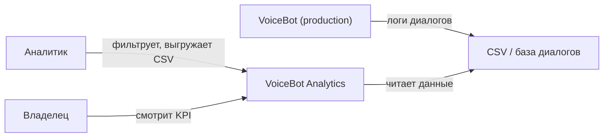
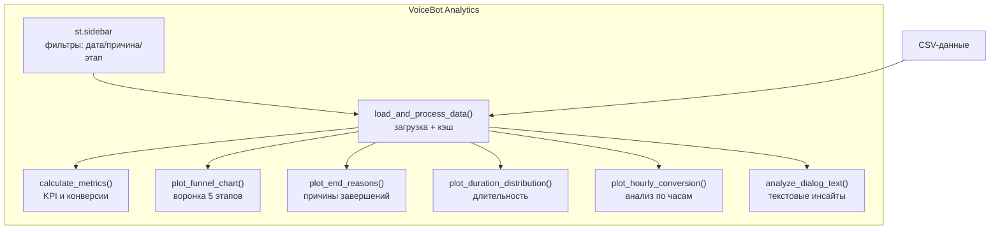
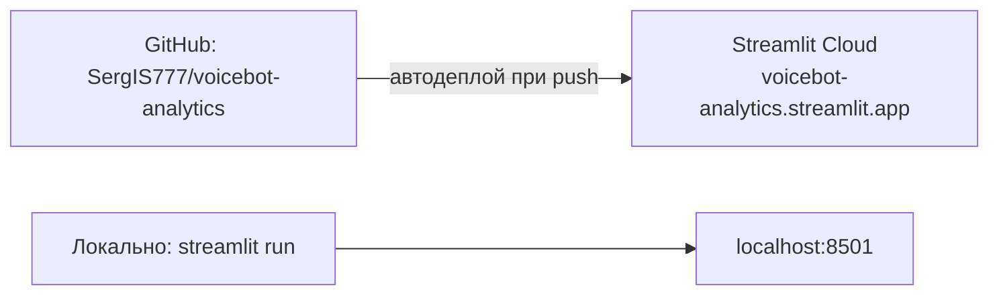

# Architecture — VoiceBot Analytics

Документ оформлен по стандарту **arc42** (12 секций), диаграммы — по уровням **C4** (Context → Container → Component) в mermaid.

---

## 1. Введение и цели

**VoiceBot Analytics** — продуктовый аналитический дашборд для анализа диалогов голосового AI-бота (VoiceBot). От метрик — к гипотезам и A/B-тестам.

### Топ-3 цели
1. **Выявление узких мест** воронки конверсии (где бот теряет клиентов)
2. **Генерация гипотез** для A/B-тестов на основе данных
3. **Zero-cost аналитика** без платных BI-систем

### Стейкхолдеры
| Роль | Интерес |
|------|---------|
| Владелец бизнеса | конверсия, причины завершений, слабые точки |
| Продукт-аналитик | фильтры, экспорт CSV, гипотезы |
| Разработчик бота | какие этапы и скрипты проседают |

---

## 2. Ограничения архитектуры

- Данные: синтетическая генерация 11 486 диалогов (production-подключение CSV/API — в roadmap)
- Стек: Python 3.11 + Streamlit + pandas + Plotly, без GPU
- Деплой: Streamlit Cloud (free) или локально `streamlit run`
- Один разработчик — решения оптимизированы под простоту поддержки

---

## 3. Контекст системы (C4 Level 1: Context)

**Бизнес-контекст:** VoiceBot генерирует диалоги → логи складываются в CSV → дашборд визуализирует → аналитик находит слабое место (конверсия 2→3 = 45%) → формулирует A/B-гипотезу → разработчик улучшает скрипт бота → цикл замыкается.

**Технический контекст:** один Streamlit-дашборд читает данные через pandas, рисует через Plotly. Никаких БД, внешних API и микросервисов — осознанная простота.

---

## 4. Стратегия решений

| Решение | Обоснование | Альтернатива (отклонена) |
|---------|-------------|--------------------------|
| Streamlit | UI-компоненты из коробки, деплой в 2 клика | Flask+Dash: больше кода, дольше запуск |
| Plotly | интерактив (zoom, hover), экспорт PNG | Matplotlib: статично |
| pandas | фильтрация 11к строк за миллисекунды | SQL: избыточно для объёма |
| CSV вместо БД | данные статичны, транзакции не нужны | PostgreSQL: нужен хостинг и админ |
| Streamlit Cloud | бесплатно, автодеплой из GitHub | свой VPS: платно и нужно обслуживать |
| `@st.cache_data` | данные грузятся один раз, повторные визиты мгновенные | без кэша: тормоза на каждом открытии |

---

## 5. Структура блоков (C4 Level 2: Container, Level 3: Component)

**Таблица-карта файлов:**
| Файл | Роль | Связан с |
|------|------|----------|
| `voicebot-analytics.py` | весь дашборд: загрузка, метрики, графики, UI | requirements.txt, Streamlit Cloud |
| `requirements.txt` | зависимости: streamlit, pandas, plotly | деплой |
| `voicebot-analytics.jpeg` | визуальная схема пайплайна для README | README.md |
| `README.md` | презентация: метрики, инсайты, A/B-гипотеза | GitHub, Streamlit Cloud |
| `LICENSE` | MIT | — |
| `.devcontainer/` | среда VS Code Dev Containers | локальная разработка |

**Точка входа:** чтение начинай с `main()` в `voicebot-analytics.py` — там порядок отрисовки блоков.

---

## 6. Runtime-сценарии

**Сценарий 1 — первый запуск:**
1. Пользователь открывает voicebot-analytics.streamlit.app
2. Streamlit выполняет скрипт → `load_and_process_data()` генерирует/читает данные
3. `@st.cache_data` кладёт DataFrame в кэш
4. `calculate_metrics()` считает KPI → рендер метрик и графиков

**Сценарий 2 — применение фильтра:**
1. Аналитик выбирает `причина = client_hangup` в sidebar
2. Streamlit перезапускает скрипт с новым состоянием виджетов
3. Данные берутся из кэша (не регенерируются)
4. pandas-фильтр сужает DataFrame → метрики и графики пересчитываются

**Сценарий 3 — деградация при битых данных:**
1. В данных отсутствует колонка или формат даты битый
2. Блок оборачивается в проверку/try-except → секция пропускается
3. Дашборд не падает целиком (graceful degradation)

---

## 7. Деплой и масштабирование

**Текущая инфраструктура:** 1 инстанс Streamlit Cloud, данных 11к строк — в RAM помещается с запасом.

**План масштабирования:**
| Нагрузка | Узкое место | Решение |
|----------|-------------|---------|
| до 100 пользователей | нет | текущая схема |
| 100к+ строк | RAM (pandas держит всё в памяти) | DuckDB/Parquet + агрегаты |
| 1000+ одновременных | один инстанс | несколько инстансов + LB, либо Docker на VPS |
| real-time данные | статичный CSV | подключение к БД диалогов voicebot |

**Восстановление при падении:** Streamlit Cloud сам перезапускает приложение при crash; состояние не теряется (stateless). Локально — просто перезапустить `streamlit run`.

---

## 8. Сквозные концепции

- **Кэширование:** `@st.cache_data` на загрузке — единая точка оптимизации
- **Фильтрация:** только через pandas-маски, единый паттерн `df[условие]`
- **Graceful degradation:** каждая секция переживает отсутствие своих данных
- **Валидация:** проверка форматов дат и категорий до отрисовки
- **Responsive:** `st.set_page_config(layout="wide")`, графики адаптируются под мобильные

---

## 9. Архитектурные решения (ADR-lite)

**ADR-1: монолит в одном файле.**
Контекст: дашборд одного проекта, не библиотека. Решение: всё в `voicebot-analytics.py`. Обоснование: проще деплой, нет настройки импортов. Последствия: при росте — рефактор на `data_loader.py / metrics.py / plots.py` (зафиксировано в техдолге).

**ADR-2: CSV/синтетика вместо живой БД.**
Контекст: цель — показать аналитическую логику, а не тащить production-данные в публичное демо. Решение: генерация данных. Обоснование: безопасность (логи не уходят наружу), воспроизводимость. Последствия: подключение live-данных — следующий шаг roadmap.

**ADR-3: Streamlit Cloud вместо VPS.**
Обоснование: бесплатно, автодеплой, не нужно обслуживать. Альтернатива (VPS+Docker) отклонена для демо, но зафиксирована как путь в production.

---

## 10. Требования к качеству

| Требование | Сценарий | Целевая метрика |
|------------|----------|-----------------|
| Производительность | первое открытие | < 3 c (кэш) |
| Производительность | применение фильтра | < 0.5 c |
| Отказоустойчивость | битая колонка в данных | секция пропускается, дашборд жив |
| Доступность | мобильный браузер | графики читаются без горизонтального скролла |
| Воспроизводимость | повторный запуск | те же метрики при тех же данных (seed) |

---

## 11. Риски и технический долг

**Риски:**
- Free-тариф Streamlit Cloud может урезать ресурсы при росте трафика → митигация: готовый путь в Docker (секция 7)
- Рост данных до 100к+ строк → тормоза pandas → митигация: DuckDB/агрегаты

**Техдолг (осознанный):**
- Нет pytest-тестов на `calculate_metrics()` и `determine_dialog_stage()` — план: вынести в модуль + покрыть тестами
- Монолит 40 КБ — план: модульная структура при росте
- Нет логирования — план: `logging` + health-метрики при переходе на VPS

---

## 12. Глоссарий

| Термин | Значение |
|--------|----------|
| Воронка конверсии | доля диалогов, дошедших до каждого из 5 этапов |
| Этапы 0–4 | 0: не состоялся; 1: приветствие; 2: оффер; 3: встреча; 4: квалификация |
| `client_hangup` / `bot_hangup` | клиент положил трубку / бот завершил |
| `@st.cache_data` | кэш результатов функции в Streamlit |
| Graceful degradation | деградация секции без падения системы |
| A/B-гипотеза | проверяемое изменение скрипта бота (см. README: гипотеза 2→3) |

---

## Как менять этот проект

| Хочу… | Куда идти |
|-------|-----------|
| добавить график | новая `plot_*()` + вызов в `main()` |
| добавить фильтр | `st.sidebar.*` + маска в фильтрации |
| поменять метрику | `calculate_metrics()` |
| подключить живые данные | `load_and_process_data()` (ADR-2) |
| задеплоить в production | Docker-путь из секции 7 |

После правки: `git add . && git commit && git push` — Streamlit Cloud подхватит автоматически.