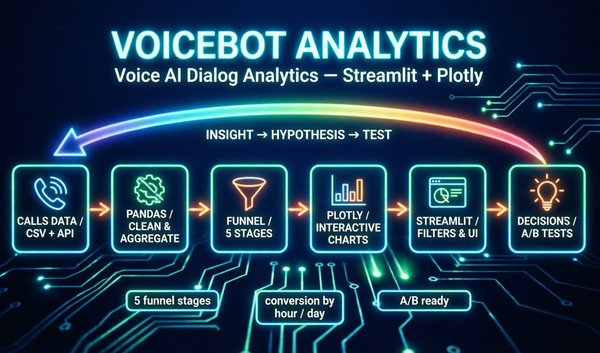

## Voicebot Analytics

---

  

Дашборд продуктовой аналитики диалогов голосового AI-бота.

---

## 🔗 Готовый дашборд

(https://voicebot-analytics.streamlit.app/)

---

## 📋 Описание проекта

Инструмент для быстрой оценки эффективности голосового AI-бота и поиска точек роста конверсии. Вырос из тестового задания на Product Owner, используется для анализа production-диалогов моего voicebot.

---

## 📚 **Полная архитектурная документация** (arc42 + C4): [ARCHITECTURE.md](ARCHITECTURE.md)

---

## 🎯 Цели дашборда

1. **Быстрая оценка состояния** — общая картина за неделю
2. **Выявление слабых мест** — на каком этапе бот теряет клиентов
3. **Формулирование гипотез** — почему это происходит
4. **Планирование A/B-тестов** — конкретные изменения для тестирования

---

## 📊 Ключевые метрики

### 1. Воронка конверсии (Funnel Analysis)

Доля диалогов, дошедших до каждого этапа:

- **Этап 0:** Звонок не состоялся / клиент сбросил сразу
- **Этап 1:** Приветствие и согласие на разговор
- **Этап 2:** Рассказ про оффер
- **Этап 3:** Договоренность о встрече
- **Этап 4:** Квалификация клиента

**Зачем:** показывает узкие места, позволяет приоритизировать улучшения скрипта.

### 2. Конверсия между этапами

Процент диалогов, переходящих с этапа N на N+1.

**Пример:** конверсия 1→2 = 40% означает, что 60% уходят после приветствия. Более точная метрика, чем общая конверсия.

### 3. Причины завершения

- `client_hangup` — клиент сам положил (проблема контента)
- `bot_hangup` — бот завершил (проблема логики)
- `no_answer`, `busy` — технические причины (база/время звонков)

---

## 🔍 Инсайты из данных (11,486 диалогов)

### Слабая точка
Переход **Этап 2 → Этап 3** (Оффер → Встреча): конверсия ~45%.

Почти половина клиентов, заинтересованных в оффере, не хотят обсуждать встречу.

### Причины завершений
- `client_hangup`: ~40%
- `bot_hangup`: ~25%
- `no_answer`: ~15%

### Длительность
- Средняя: ~1.5 минуты
- Успешные (этап 4): ~3-4 минуты
- Неудачные: ~30-60 секунд

---

## 🚀 Гипотеза и A/B-тест

**Проблема:** низкая конверсия 2→3 (~45%)

**Гипотеза:** бот недостаточно убедительно переводит разговор к обсуждению встречи.

### Вариант A (контроль)

Бот: У нас есть предложение для таких компаний.
Клиент: Расскажите подробнее.
Бот: [описание оффера]
Бот: Давайте обсудим на встрече. Когда удобно?

### Вариант B (эксперимент)

Бот: У нас есть предложение для таких компаний.
Клиент: Расскажите подробнее.
Бот: [описание оффера]
Бот: Это предложение ограничено по времени. Подходит ли вам в принципе?
Клиент: Да / Нет
Бот (если Да): Отлично! Когда удобно встретиться?

**Ключевые изменения:**
1. Вопрос о принципиальной заинтересованности перед переходом к встрече
2. "Мягкая" точка выхода для незаинтересованных
3. Возможность уточнить возражения

**Целевые метрики:**
- Основная: конверсия 2→3 (цель: 45% → 60%)
- Вторичные: общая конверсия в этап 4, средняя длительность

---

**🔗 Живое демо:** [voicebot-analytics.streamlit.app](https://voicebot-analytics.streamlit.app)

🎨 Возможности
🔍 Фильтры: дата, причина завершения, этап
📊 Интерактивные графики (Plotly)
📈 Воронка конверсии
⏰ Анализ по часам/дням недели
💬 Анализ текста диалогов

💡 Дальнейшее развитие
- Интеграция с live-данными voicebot
- NLP-анализ для автоопределения этапов
- Трекинг A/B-тестов
- Автоматические инсайты и детекция аномалий

---

## Автор: **Сергей Исаков** 

## Стек: **Python, Streamlit, pandas, Plotly Связанные проекты: https://github.com/SergIS777/ml-loop · https://github.com/SergIS777/voicebot · https://github.com/SergIS777/multi-agent-rag**

---
